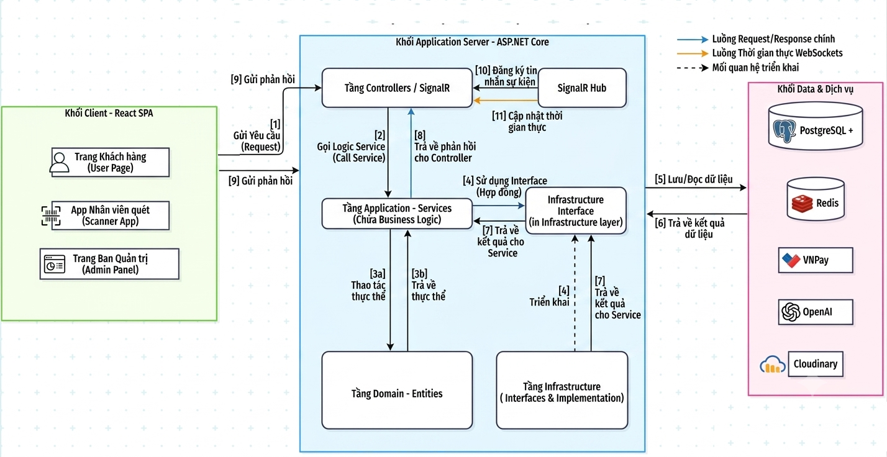
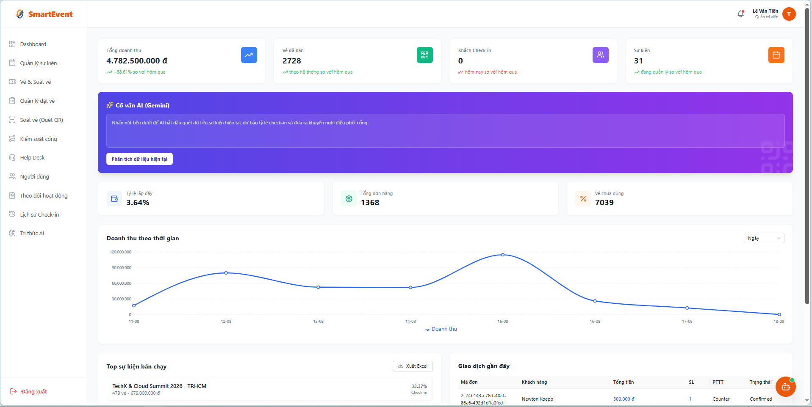
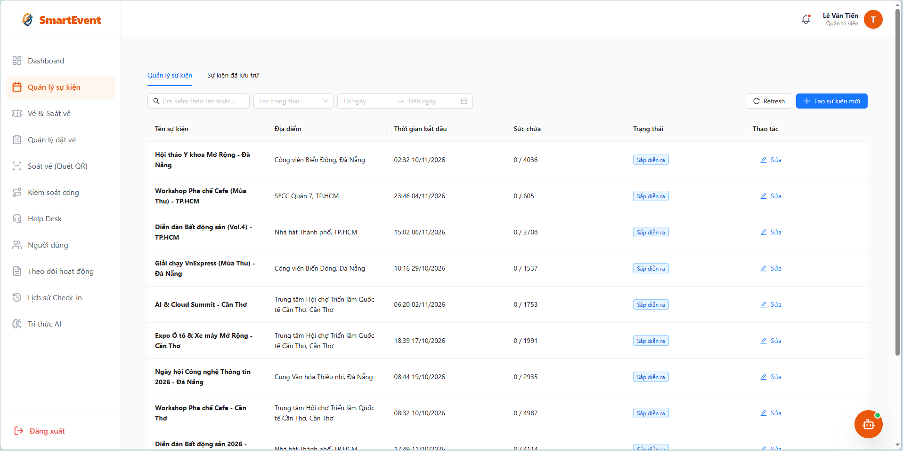
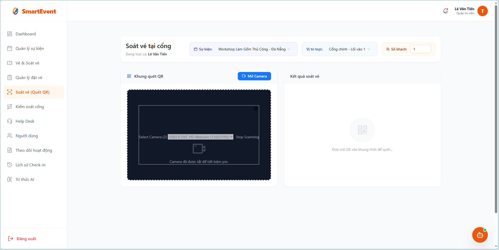
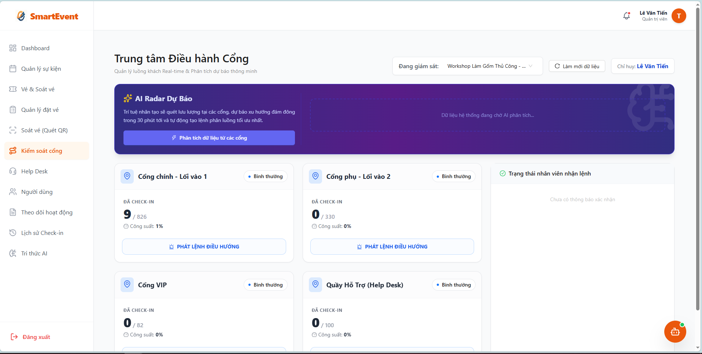

# SmartEvent

### Event & Ticket Management Platform

SmartEvent is a full-stack event and ticket management platform designed to support event organizers, administrators, staff, and customers throughout the event lifecycle.

The system provides event and ticket management, online booking, QR-based ticket check-in, real-time communication, background processing, automated testing, and performance testing.

The project consists of a **React frontend** and an **ASP.NET Core backend**, with a layered backend architecture designed to separate API, application, domain, and infrastructure concerns.

---

## Overview

Managing events and ticket operations involves multiple workflows such as event creation, ticket configuration, customer booking, ticket validation, and attendee check-in.

SmartEvent centralizes these workflows into a single platform and provides tools for administrators and event staff to manage events and monitor ticket operations efficiently.

### Main workflow

```text
Event Organizer / Admin
          │
          ▼
     Create Event
          │
          ▼
   Configure Tickets
          │
          ▼
      Customers
          │
          ▼
    Book / Receive Ticket
          │
          ▼
      QR Code Ticket
          │
          ▼
     Event Check-in
          │
          ▼
 Ticket Validation & Status Update
          │
          ▼
   Real-time Event Updates
```

---

## Key Features

### Authentication & Authorization

* User authentication using JWT
* Role-based authorization
* User and account management
* OTP/TOTP-based authentication support
* Protected API endpoints

### Event Management

* Create and manage events
* Configure event information
* Manage event lifecycle and status
* Manage event-related information

### Ticket Management

* Manage ticket types
* Ticket booking and order workflows
* Ticket validation
* Ticket status management
* Ticket-related business workflows

### QR Code Check-in

* Generate QR-based tickets
* Scan and validate tickets
* Process attendee check-in
* Prevent invalid ticket usage
* Support check-in operations at event gates

### Real-time Communication

* Real-time communication using SignalR
* Real-time event/check-in updates
* Support for operational monitoring during events

### Background Processing

* Background job processing using Hangfire
* Scheduled and asynchronous processing
* Support for long-running or non-blocking background operations

### Caching & Infrastructure

* Redis-based caching
* Entity Framework Core for data access
* PostgreSQL / SQL Server database support
* Cloudinary integration for media management

### AI Integration

* AI-related services for event management workflows
* Vector database support through PostgreSQL/pgvector
* Support for AI-powered application features

### Testing & Performance Testing

* Automated backend tests
* Integration testing
* Service-level testing
* API testing
* Performance and load testing using Apache JMeter

---

## My Contribution

As a Backend & Full-stack Developer, my contributions include:

* Developed RESTful APIs for event and ticket management using **ASP.NET Core 9** and **Entity Framework Core**, covering event configuration, ticket types, QR-based ticketing, and check-in workflows.

* Implemented real-time QR check-in using an **Event-Driven Architecture** with **MediatR** and **SignalR**, synchronizing check-in status and attendee occupancy data with the management dashboard.

* Implemented **Hangfire background jobs** to automatically update event statuses based on scheduled time conditions, reducing the need for manual status management.

* Developed an **AI-powered Admin Chatbot** using **Retrieval-Augmented Generation (RAG)**, integrating vector embeddings with **PostgreSQL pgvector** and the **Gemini API** to retrieve internal event knowledge and provide contextual responses.

* Implemented **AI-powered event analytics** to analyze ticket sales and check-in data, generating event trends and operational insights for administrators through the management dashboard.

* Developed **Admin, Check-in, and Dashboard interfaces** using **React 19**, integrating RESTful APIs and **SignalR Client** for real-time data synchronization.

* Managed source code and collaborative development using **Git and GitHub**.


---

## Tech Stack

### Backend

* C#
* ASP.NET Core 9
* Entity Framework Core
* MediatR
* RESTful API
* Swagger / OpenAPI

### Authentication & Security

* JWT Bearer Authentication
* Role-based Authorization
* OTP / TOTP

### Database & Storage

* PostgreSQL
* SQL Server
* Redis
* PostgreSQL pgvector

### Real-time & Background Processing

* SignalR
* Hangfire

### Frontend

* React
* Vite
* Tailwind CSS
* Ant Design
* Axios
* Zustand

### AI & External Services

* AI service integrations
* Cloudinary
* MailKit

### Testing

* Automated Testing
* Integration Testing
* API Testing
* Apache JMeter
* Load / Concurrency Testing

### DevOps

* Docker

---

## System Architecture

SmartEvent follows a layered backend architecture built with ASP.NET Core, separating presentation, application, domain, and infrastructure concerns.

The system consists of a React-based frontend, ASP.NET Core application server, database and caching infrastructure, and integrations with external services.



### Architecture Components

| Component                 | Responsibility                                                                   |
| ------------------------- | -------------------------------------------------------------------------------- |
| **React SPA**             | Provides user, scanner, and administrator interfaces                             |
| **Controllers / SignalR** | Handles HTTP requests and real-time communication                                |
| **Application Services**  | Implements application workflows and business logic                              |
| **Domain / Entities**     | Contains core domain entities and business concepts                              |
| **Infrastructure**        | Provides database access and external service implementations                    |
| **PostgreSQL**            | Stores persistent application data                                               |
| **Redis**                 | Provides caching and supporting infrastructure                                   |
| **SignalR Hub**           | Enables real-time communication between the server and connected clients         |
| **External Services**     | Integrates payment, AI, and media services such as VNPay, OpenAI, and Cloudinary |

### Main Request Flow

```text
React Client
     │
     ▼
Controllers / SignalR
     │
     ▼
Application Services
     │
     ▼
Infrastructure Interfaces
     │
     ▼
Database / External Services
```

### Real-time Communication

The system uses **SignalR** to provide real-time updates between the backend and connected clients.

This is used for scenarios such as:

* Real-time QR check-in updates
* Synchronizing attendee occupancy information
* Updating the management dashboard
* Sending event-related updates to connected clients

### Backend Layers

| Layer              | Responsibility                                                      |
| ------------------ | ------------------------------------------------------------------- |
| **API**            | HTTP endpoints, authentication, authorization and API configuration |
| **Application**    | Application services, use cases and business workflows              |
| **Domain**         | Core entities and domain rules                                      |
| **Infrastructure** | Database access, caching and external service integrations          |


## Project Structure

```text
SmartEvent/
│
├── Backend/
│   ├── TicketSystem.API/
│   ├── TicketSystem.Application/
│   ├── TicketSystem.Domain/
│   └── TicketSystem.Infrastructure/
│
├── Frontend/
│
├── TicketSystem.Tests/
│   ├── Integration/
│   ├── Services/
│   └── TestHelpers/
│
├── performance-tests/
│   └── jmeter/
│
├── checkin-test.js
├── package.json
├── package-lock.json
└── .gitignore
```

---

## Testing

Testing is organized separately from the main backend implementation.

### Automated Testing

The repository contains dedicated backend test projects covering service-level and integration scenarios.

```text
TicketSystem.Tests/
├── Integration/
├── Services/
└── TestHelpers/
```

### Performance Testing

Apache JMeter is used to evaluate API performance and concurrent request handling.

Performance test scenarios are maintained under:

```text
performance-tests/
└── jmeter/
```

The repository also contains a dedicated check-in test script for validating check-in behavior under concurrent requests.

> Detailed test results and performance metrics will be documented separately as the project documentation is expanded.

---

## API Documentation

The backend exposes RESTful APIs and provides Swagger/OpenAPI documentation for API exploration and testing.

The API covers major system modules such as:

* Authentication
* Users
* Events
* Tickets
* Orders
* Check-in
* Event operations
* Administration

> Detailed API endpoint documentation can be added in `docs/api.md`.

---

## Getting Started

### Prerequisites

Make sure the following tools are installed:

* .NET 9 SDK
* Node.js
* PostgreSQL and/or SQL Server
* Redis
* Git
* Docker (optional)

---

### 1. Clone the Repository

```bash
git clone https://github.com/WangHi05/SmartEvent.git

cd SmartEvent
```

---

### 2. Backend Configuration

Navigate to the backend project:

```bash
cd Backend/TicketSystem.API
```

Configure the required application settings for:

* Database connection
* JWT authentication
* Redis
* Email service
* Cloudinary
* AI services
* Other external services used by the application

> Do not commit real API keys, passwords, database credentials, or production secrets to the repository.

---

### 3. Run the Backend

From the API project:

```bash
dotnet restore
dotnet build
dotnet run
```

The exact API URL depends on the local ASP.NET Core launch configuration.

---

### 4. Run the Frontend

Navigate to the frontend directory:

```bash
cd Frontend
```

Install dependencies:

```bash
npm install
```

Run the development server:

```bash
npm run dev
```

---

## Environment Variables & Secrets

Sensitive configuration should be provided through local environment configuration or .NET User Secrets rather than committed directly to Git.

Typical configuration may include:

```text
Database connection string
JWT configuration
Redis connection
Cloudinary credentials
Email credentials
AI API credentials
```

For a public repository, make sure all real credentials are removed before publishing the project.

---

## Demo

A complete demo walkthrough can demonstrate the following workflow:

```text
Login
  ↓
Create / Browse Event
  ↓
Configure Ticket
  ↓
Book Ticket
  ↓
Generate QR Ticket
  ↓
Scan QR Code
  ↓
Validate Ticket
  ↓
Check-in
  ↓
Update Event Status
  ↓
Real-time Monitoring
```

> [URL Demo](https://smart-event-one.vercel.app/).

---

## Screenshots

Screenshots will be added to demonstrate the main features of the platform.

Recommended screenshots:

1. Dashboard
2. Event Management
3. Ticket Management
4. Ticket Booking
5. QR Check-in
6. Real-time Monitoring

Dashboard:


Event Management


QR Check-in


Gate Control Real-time


---

## Performance Testing

Performance testing is performed using Apache JMeter.

The repository contains dedicated test plans under:

```text
performance-tests/jmeter/
```

Example scenarios include:

* Event API load testing
* Concurrent API requests
* Ticket/check-in related testing

Performance results should be reported using measurable metrics such as:

* Number of concurrent users
* Throughput
* Average response time
* Percentile response time
* Error rate

> Actual benchmark values should be added only after the corresponding tests have been executed and verified.

---

## Future Improvements

Potential improvements include:

* Expand automated test coverage
* Improve API observability and logging
* Add CI/CD pipeline
* Improve production deployment configuration
* Extend performance testing scenarios
* Improve monitoring and operational dashboards
* Further optimize caching and database access

---

## Contributors

This project was developed collaboratively.

* Dinh Quang Huy
* Le Van Tien
---

## License

This project is developed for educational and portfolio purposes.
